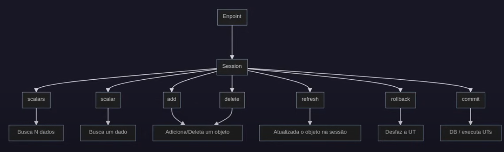

# Integrando Banco de Dados (SQLAlchemy) ao FastAPI

# Sessão

A principal peça da nossa integração é a sessão do ORM. Ela precisa ser visível aos endpoints para que eles possam se comunicar com o banco.

## Padrões da sessão

- **Repositório**: A sessão atua como um repositório. A ideia de um repositório é abstrair qualquer interação envolvendo persistência de dados

- **Unidade de Trabalho**: Quando a sessão é aberta, todos os dados inseridos, modificados ou deletados não são feitos de imediato no banco de dados. Fazemos todas as modificações que queremos e executamos uma única ação (commit), uma única chamada para economizar recursos

- **Mapeamento de Identidade**: É criado um cache para as entidades que já estão carregadas na sessão para evitar conexões desncessárias


## De forma visual



## Código com exemplos

```python
from fast_zero.setting import Settings
from sqlalchemy import create_engine
from sqlalchemy.orm import Session

# Cria o pool de conexões
engine = create_engine(Settings().DATABASE_URL)

session = Session(engine)  # Cria a sessão

session.add(obj)        # Adiciona no banco
session.delete(obj)     # Remove do banco
session.refresh(obj)    # Atualiza o objeto com a sessão

session.scalars(query)  # Lista N objetos
session.scalar(query)   # Lista 1 objeto

session.commit()        # Executa as UTs no banco
session.rollback()      # Desfaz as UTs

session.begin()         # Inicia a sessão
session.close()         # Fecha a sessão
```

# Entendendo endpoint de cadastro

- O email não pode existir na base de dados (único)
- O username não pode existir na base de dados (único)
- Se existir (1 ou 2), devemos dizer que já está cadastrado com um erro
- Caso não exista, deve ser inserido na base de dados

# Gerenciando Dependências com FastAPI

FastAPI usa um conceito de padrão chamado "Injeçã de Dependência", por meio do objeto *Depends*

É uma maneira declarativa de dizer ao FastAPI:

    Antes de executar essa função, execute primeiro essa outra função e passe o resultado para o parâmetro